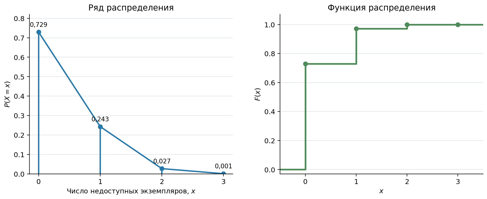
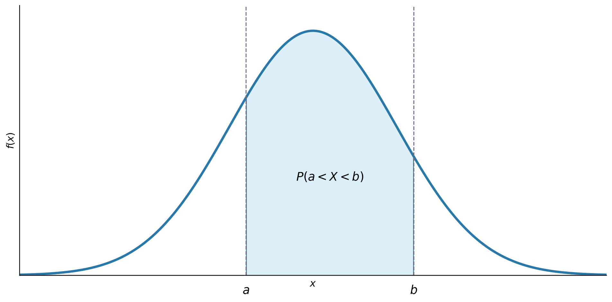

# Закон распределения случайной величины

Перечень возможных значений случайной величины сам по себе ещё не позволяет оценивать риск и принимать решения. Необходимо знать, с какими вероятностями появляются эти значения. Связь между возможными значениями случайной величины и соответствующими им вероятностями задаёт *закон распределения* [@VentselOvcharov2010_ProbabilityEngineering; @Gmurman2019_ProblemsGuide].

## Распределение дискретной случайной величины

Для дискретной случайной величины $X$, принимающей значения $x_1, x_2, \ldots, x_n$, закон распределения можно представить таблицей. В первой строке указывают возможные значения, во второй — вероятности $p_i=P(X=x_i)$:

| $X$ | $x_1$ | $x_2$ | $\ldots$ | $x_n$ |
|---|---:|---:|:---:|---:|
| $P$ | $p_1$ | $p_2$ | $\ldots$ | $p_n$ |

События $X=x_i$ несовместны и вместе образуют полную группу, поэтому сумма вероятностей всех возможных значений равна единице:

$$
\sum_{i=1}^{n} p_i = 1.
$$ {#eq-10-discrete-probability-sum}

Графическое представление такого ряда называют *многоугольником распределения*: точки $(x_i,p_i)$ отмечают на координатной плоскости и соединяют отрезками. Высота каждой точки показывает вероятность соответствующего значения, но вероятность не равна площади под линией многоугольника.

::: {.example #exm-10-service-instances}

В цифровом сервисе одновременно работают три независимых экземпляра приложения. Вероятность того, что каждый экземпляр будет доступен в течение контрольного интервала, равна $p=0{,}9$, а вероятность недоступности — $q=0{,}1$. Случайная величина $X$ равна числу недоступных экземпляров. Построить ряд распределения $X$ и проверить его полноту.

***Решение.*** Число недоступных экземпляров может принимать значения $0$, $1$, $2$ и $3$. Для расчёта используется @eq-03-bernoulli-formula:

$$
\begin{aligned}
P(X=0) &= 0{,}9^3 = 0{,}729,\\
P(X=1) &= C_3^1 \cdot 0{,}1 \cdot 0{,}9^2 = 0{,}243,\\
P(X=2) &= C_3^2 \cdot 0{,}1^2 \cdot 0{,}9 = 0{,}027,\\
P(X=3) &= 0{,}1^3 = 0{,}001.
\end{aligned}
$$

Ряд распределения имеет вид:

| $X$ | 0 | 1 | 2 | 3 |
|---|---:|---:|---:|---:|
| $P$ | 0,729 | 0,243 | 0,027 | 0,001 |

В этом ряду выполняется @eq-10-discrete-probability-sum:

$$
0{,}729+0{,}243+0{,}027+0{,}001=1.
$$

{#fig-discrete-distribution fig-pos="H" fig-alt="Слева вероятности нуля, одного, двух и трёх недоступных экземпляров показаны точками и вертикальными отрезками; справа изображена соответствующая ступенчатая функция распределения"}

:::

## Функция распределения

Ряд распределения применим только к дискретной величине. Универсальной формой закона распределения является *функция распределения*:

$$
F(x)=P(X\leq x).
$$ {#eq-10-cdf-definition}

Значение $F(x)$ показывает вероятность того, что случайная величина не превысит заданное число $x$. Для дискретной величины функция распределения ступенчатая: в каждой точке $x_i$ она увеличивается на $P(X=x_i)$. Данные для функции, показанной в правой части @fig-discrete-distribution, задаёт @exm-10-service-instances.

Функция распределения обладает следующими свойствами:

1. $0\leq F(x)\leq 1$ для любого $x$;
2. если $x_1<x_2$, то $F(x_1)\leq F(x_2)$;
3. $\lim\limits_{x\to-\infty}F(x)=0$, а $\lim\limits_{x\to+\infty}F(x)=1$;
4. вероятность попадания в промежуток выражается через значения функции на его границах:

$$
P(a<X\leq b)=F(b)-F(a).
$$ {#eq-10-cdf-interval}

Последняя запись учитывает возможный скачок функции распределения в точке $b$. Для непрерывной случайной величины вероятность отдельного значения равна нулю, поэтому включение или исключение границ интервала не меняет результат.

## Плотность распределения непрерывной величины

Для непрерывной случайной величины функцию распределения часто можно представить через неотрицательную функцию $f(x)$, которую называют *плотностью распределения*. В точках дифференцируемости $F(x)$ выполняются соотношения:

$$
f(x)=F'(x),
\qquad
F(x)=\int_{-\infty}^{x} f(t)\,dt.
$$ {#eq-10-density-cdf}

Плотность не является вероятностью отдельного значения. Она описывает, как вероятность распределена по числовой оси. Площадь под всей кривой плотности равна единице:

$$
f(x)\geq 0,
\qquad
\int_{-\infty}^{+\infty} f(x)\,dx=1.
$$ {#eq-10-density-properties}

Вероятность попадания непрерывной случайной величины в интервал равна площади под кривой плотности на этом интервале:

$$
P(a<X<b)=\int_a^b f(x)\,dx.
$$ {#eq-10-density-interval}

{#fig-continuous-density fig-pos="H" fig-alt="Колоколообразная кривая плотности; область между точками a и b закрашена и обозначает вероятность попадания случайной величины в этот интервал"}

Закон распределения даёт полное вероятностное описание случайной величины, однако в прикладной работе часто нужны более компактные характеристики: типичное значение и степень разброса. Они рассматриваются в следующем разделе.
