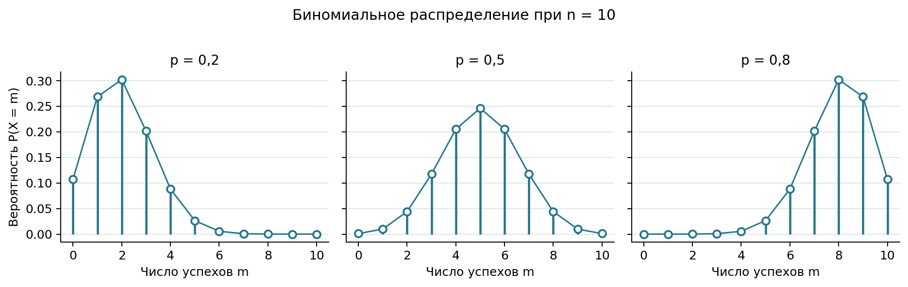

# Распространённые дискретные распределения

Выбор закона распределения определяется устройством случайного опыта. В одних задачах считают число попыток до первого успеха, в других — число объектов с нужным признаком в выборке или число событий за заданный интервал. Ниже рассмотрены четыре модели, часто встречающиеся в продуктовой аналитике, контроле качества и эксплуатации цифровых сервисов [@VentselOvcharov2010_ProbabilityEngineering; @Gmurman2019_ProblemsGuide].

## Геометрическое распределение

Пусть независимые испытания повторяются до первого появления события $A$, а вероятность события в каждом испытании постоянна и равна $p$. Случайная величина $X$ — число испытаний, включая успешное. Тогда $X$ имеет *геометрическое распределение*:

$$
P(X=m)=(1-p)^{m-1}p,
\qquad m=1,2,\ldots
$$ {#eq-12-geometric-probability}

В этой книге используется именно число испытаний до первого успеха. При другой распространённой договорённости считают только предшествующие неудачи, и возможные значения начинаются с нуля.

Обозначив $q=1-p$, проверим сумму вероятностей:

$$
\sum_{m=1}^{\infty}q^{m-1}p
=p\sum_{k=0}^{\infty}q^k
=\frac{p}{1-q}
=1.
$$ {#eq-12-geometric-total}

Математическое ожидание, дисперсия и стандартное отклонение равны:

$$
M[X]=\frac{1}{p},
\qquad
D[X]=\frac{1-p}{p^2},
\qquad
\sigma_X=\frac{\sqrt{1-p}}{p}.
$$ {#eq-12-geometric-characteristics}

::: {.example #exm-12-geometric-deployment}

Независимый автоматический запуск развёртывания завершается успешно с вероятностью $p=0{,}65$. Найти вероятность того, что для первого успешного развёртывания потребуется не более трёх запусков.

***Решение.*** Событие $X\leq3$ противоположно трём последовательным неудачам. Поэтому:

$$
P(X\leq3)=1-(1-0{,}65)^3=1-0{,}35^3=0{,}957125.
$$

Расчёт опирается на постоянство вероятности успеха и независимость запусков. Если после каждой неудачи команда изменяет конфигурацию, эти предпосылки могут не выполняться.

:::

## Гипергеометрическое распределение

Пусть в конечной совокупности из $N$ объектов ровно $M$ обладают интересующим признаком. Из совокупности без возвращения случайно выбирают $n$ объектов, а $X$ обозначает число объектов с этим признаком в выборке. Тогда $X$ имеет *гипергеометрическое распределение*:

$$
P(X=m)=
\frac{\binom{M}{m}\binom{N-M}{n-m}}
     {\binom{N}{n}}.
$$ {#eq-12-hypergeometric-probability}

Возможные значения ограничены условиями:

$$
\max\bigl(0,n-(N-M)\bigr)
\leq m\leq
\min(n,M).
$$ {#eq-12-hypergeometric-support}

Числовые характеристики распределения:

$$
M[X]=n\frac{M}{N},
\qquad
D[X]=n\frac{M}{N}
\left(1-\frac{M}{N}\right)
\frac{N-n}{N-1}.
$$ {#eq-12-hypergeometric-characteristics}

Последний множитель в дисперсии называется поправкой на конечность совокупности. Он отражает зависимость отборов без возвращения.

::: {.example #exm-12-hypergeometric-stock}

На складе находятся 15 одинаковых устройств, из которых 7 уже настроены для отправки клиенту. Для контрольной проверки случайно выбирают 3 устройства без возвращения. Построить ряд распределения числа $X$ настроенных устройств в выборке.

***Решение.*** Здесь $N=15$, $M=7$, $n=3$. По @eq-12-hypergeometric-probability:

| $m$ | 0 | 1 | 2 | 3 |
|---:|---:|---:|---:|---:|
| $P(X=m)$ | $8/65$ | $28/65$ | $24/65$ | $1/13$ |
| Приближённо | 0,1231 | 0,4308 | 0,3692 | 0,0769 |

Например, при $m=2$:

$$
P(X=2)
=\frac{\binom{7}{2}\binom{8}{1}}{\binom{15}{3}}
=\frac{24}{65}
\approx0{,}3692.
$$

Сумма вероятностей равна единице. Математическое ожидание составляет $M[X]=3\cdot7/15=1{,}4$, а дисперсия — $D[X]=0{,}64$.

:::

## Биномиальное распределение

В серии из $n$ независимых испытаний событие $A$ происходит с постоянной вероятностью $p$. Если $X$ — число появлений события, то $X$ имеет *биномиальное распределение* с параметрами $n$ и $p$. Его вероятности задаются формулой Бернулли @eq-03-bernoulli-formula:

$$
P(X=m)=\binom{n}{m}p^m(1-p)^{n-m},
\qquad m=0,1,\ldots,n.
$$ {#eq-12-binomial-probability}

Название распределения связано с тем, что эти вероятности являются членами разложения бинома $(p+(1-p))^n$. Числовые характеристики равны:

$$
M[X]=np,
\qquad
D[X]=np(1-p),
\qquad
\sigma_X=\sqrt{np(1-p)}.
$$ {#eq-12-binomial-characteristics}

{#fig-12-binomial-distributions fig-alt="Три многоугольника биномиального распределения для десяти испытаний и вероятностей успеха 0,2, 0,5 и 0,8"}

При $p<0{,}5$ вероятностная масса сосредоточена ближе к малым значениям $X$, при $p>0{,}5$ — ближе к большим. При $p=0{,}5$ распределение симметрично.

::: {.example #exm-12-binomial-conversions}

Пусть каждый из четырёх независимо привлечённых посетителей оформляет заказ с вероятностью $p=0{,}2$. Построить ряд распределения числа заказов $X$, найти его числовые характеристики и вероятности событий $X\geq1$ и $X\leq2$.

***Решение.*** По @eq-12-binomial-probability:

| $m$ | 0 | 1 | 2 | 3 | 4 |
|---:|---:|---:|---:|---:|---:|
| $P(X=m)$ | 0,4096 | 0,4096 | 0,1536 | 0,0256 | 0,0016 |

Сумма вероятностей равна единице. По @eq-12-binomial-characteristics:

$$
M[X]=4\cdot0{,}2=0{,}8,
\qquad
D[X]=4\cdot0{,}2\cdot0{,}8=0{,}64,
\qquad
\sigma_X=0{,}8.
$$

Вероятность хотя бы одного заказа удобнее найти через противоположное событие:

$$
P(X\geq1)=1-P(X=0)=1-0{,}4096=0{,}5904.
$$

Для события «не более двух заказов» складываются три вероятности:

$$
P(X\leq2)
=0{,}4096+0{,}4096+0{,}1536
=0{,}9728.
$$

:::

Гипергеометрическую и биномиальную модели важно различать. Биномиальное распределение предполагает независимые испытания с постоянной вероятностью успеха. При выборе без возвращения из небольшой конечной совокупности вероятность успеха меняется, поэтому применяется гипергеометрическое распределение.

## Распределение Пуассона

Поток событий можно представить как последовательность событий со случайными интервалами между ними. *Простейший поток* обладает тремя свойствами:

- *стационарность* — вероятность заданного числа событий на интервале зависит от его длины, но не от положения на временной оси;
- *ординарность* — вероятность двух или более событий на достаточно малом интервале пренебрежимо мала по сравнению с вероятностью одного события;
- *отсутствие последействия* — числа событий на непересекающихся интервалах независимы.

Пусть $\lambda$ — средняя интенсивность потока, а $t$ — длина наблюдаемого интервала. Тогда число событий $X$ на этом интервале имеет *распределение Пуассона* с параметром $\mu=\lambda t$:

$$
P(X=m)=e^{-\mu}\frac{\mu^m}{m!},
\qquad m=0,1,2,\ldots
$$ {#eq-12-poisson-probability}

Для распределения Пуассона математическое ожидание и дисперсия совпадают:

$$
M[X]=D[X]=\mu,
\qquad
\sigma_X=\sqrt{\mu}.
$$ {#eq-12-poisson-characteristics}

Вероятность хотя бы одного события равна:

$$
P(X\geq1)=1-P(X=0)=1-e^{-\mu}.
$$ {#eq-12-poisson-at-least-one}

Распределение Пуассона также служит приближением биномиального распределения, когда $n$ велико, $p$ мало, а произведение $np=\mu$ сохраняет умеренное значение:

$$
\binom{n}{m}p^m(1-p)^{n-m}
\approx
e^{-\mu}\frac{\mu^m}{m!}.
$$ {#eq-12-poisson-approximation}

::: {.example #exm-12-poisson-support}

В службу поддержки в среднем поступает 3 обращения в час. Предположим, что поток можно считать простейшим. Найти вероятность ровно 10 обращений за четыре часа и вероятность хотя бы одного обращения за полчаса.

***Решение.*** Для четырёх часов параметр распределения равен $\mu=3\cdot4=12$. По @eq-12-poisson-probability:

$$
P(X=10)
=e^{-12}\frac{12^{10}}{10!}
\approx0{,}1048.
$$

Для получасового интервала $\mu=3\cdot0{,}5=1{,}5$. По @eq-12-poisson-at-least-one:

$$
P(X\geq1)=1-e^{-1{,}5}\approx0{,}7769.
$$

Модель следует проверять по данным: интенсивность может меняться в течение дня, а обращения могут зависеть друг от друга, например после массового сбоя.

:::
