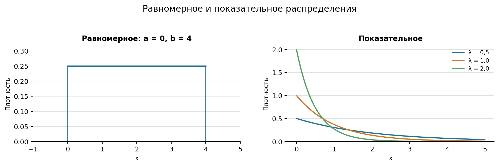
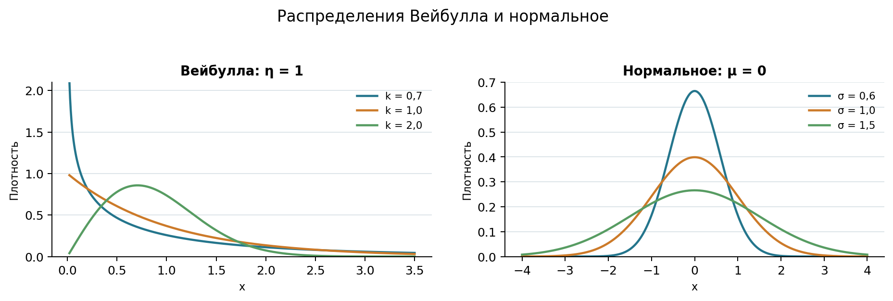

# Распространённые непрерывные распределения

Непрерывные распределения применяют, когда случайная величина может принимать любое значение на некотором интервале. Для выбора модели важно понимать происхождение данных: ограничен ли диапазон значений, описывается ли время ожидания, меняется ли интенсивность отказов и складывается ли показатель из множества небольших случайных влияний [@VentselOvcharov2010_ProbabilityEngineering; @Gmurman2019_ProblemsGuide].

## Равномерное распределение

Случайная величина $X$ имеет *равномерное распределение* на отрезке $[a,b]$, если её плотность постоянна на этом отрезке и равна нулю вне его:

$$
f(x)=
\begin{cases}
\dfrac{1}{b-a}, & a\leq x\leq b,\\
0, & \text{иначе}.
\end{cases}
$$ {#eq-13-uniform-density}

Функция распределения имеет вид:

$$
F(x)=
\begin{cases}
0, & x<a,\\
\dfrac{x-a}{b-a}, & a\leq x\leq b,\\
1, & x>b.
\end{cases}
$$ {#eq-13-uniform-cdf}

Если $a\leq c<d\leq b$, вероятность попадания в интервал $[c,d]$ пропорциональна его длине:

$$
P(c\leq X\leq d)=\frac{d-c}{b-a}.
$$ {#eq-13-uniform-interval}

Математическое ожидание, дисперсия и стандартное отклонение равны:

$$
M[X]=\frac{a+b}{2},
\qquad
D[X]=\frac{(b-a)^2}{12},
\qquad
\sigma_X=\frac{b-a}{\sqrt{12}}.
$$ {#eq-13-uniform-characteristics}

::: {.example #exm-13-uniform-start}

Фоновое задание запускается в случайный момент в пределах пятиминутного окна, причём все моменты считаются равновероятными. Пусть $X$ — время от начала окна до запуска в минутах. Найти вероятность запуска между первой и третьей минутами.

***Решение.*** Величина $X$ равномерно распределена на $[0,5]$. По @eq-13-uniform-interval:

$$
P(1\leq X\leq3)=\frac{3-1}{5-0}=0{,}4.
$$

Математическое ожидание времени запуска равно $2{,}5$ минуты. Равномерная модель уместна только при отсутствии предпочтительных моментов внутри окна.

:::

## Показательное распределение

Пусть события образуют простейший пуассоновский поток с постоянной интенсивностью $\lambda>0$. Время $T$ между соседними событиями имеет *показательное*, или *экспоненциальное*, распределение:

$$
f(t)=
\begin{cases}
\lambda e^{-\lambda t}, & t\geq0,\\
0, & t<0.
\end{cases}
$$ {#eq-13-exponential-density}

Функция распределения и вероятность ожидания дольше $t$ равны:

$$
F(t)=1-e^{-\lambda t},
\qquad
P(T>t)=e^{-\lambda t},
\qquad t\geq0.
$$ {#eq-13-exponential-cdf}

Последнее выражение совпадает с вероятностью отсутствия событий пуассоновского потока на интервале длиной $t$. Числовые характеристики:

$$
M[T]=\frac{1}{\lambda},
\qquad
D[T]=\frac{1}{\lambda^2},
\qquad
\sigma_T=\frac{1}{\lambda}.
$$ {#eq-13-exponential-characteristics}

Показательное распределение обладает свойством отсутствия памяти:

$$
P(T>s+t\mid T>s)=P(T>t).
$$ {#eq-13-exponential-memoryless}

Это означает, что уже прошедшее время ожидания не изменяет распределение оставшегося времени. Такое предположение подходит не каждому процессу: например, вероятность завершения задачи может меняться по мере её выполнения.

::: {.example #exm-13-exponential-support}

Продолжим пример с потоком обращений в службу поддержки интенсивностью $\lambda=3$ обращения в час. Найти среднее время между обращениями и вероятность того, что после очередного обращения следующее не поступит в течение получаса.

***Решение.*** По @eq-13-exponential-characteristics среднее время ожидания:

$$
M[T]=\frac{1}{3}\ \text{часа}=20\ \text{минут}.
$$

Вероятность ожидания дольше половины часа по @eq-13-exponential-cdf:

$$
P(T>0{,}5)=e^{-3\cdot0{,}5}=e^{-1{,}5}\approx0{,}2231.
$$

Результат дополняет пример с распределением Пуассона: вероятность хотя бы одного обращения за полчаса равна $1-0{,}2231=0{,}7769$.

:::

{#fig-13-uniform-exponential-distributions fig-alt="Два графика плотности: равномерное распределение на отрезке от нуля до четырёх и показательное распределение при трёх значениях интенсивности"}

У равномерного распределения плотность постоянна внутри заданного диапазона. Плотность показательного распределения убывает, причём увеличение $\lambda$ одновременно сокращает среднее время ожидания и делает начальный спад более резким.

## Распределение Вейбулла

Показательное распределение предполагает постоянную интенсивность отказов. Для процессов, в которых она меняется со временем, часто используют *распределение Вейбулла*. В двухпараметрической форме с масштабом $\eta>0$ и параметром формы $k>0$ его плотность равна:

$$
f(t)=
\begin{cases}
\dfrac{k}{\eta}
\left(\dfrac{t}{\eta}\right)^{k-1}
\exp\left[-\left(\dfrac{t}{\eta}\right)^k\right],
& t\geq0,\\
0, & t<0.
\end{cases}
$$ {#eq-13-weibull-density}

Функция распределения и функция надёжности имеют вид:

$$
F(t)=1-\exp\left[-\left(\frac{t}{\eta}\right)^k\right],
\qquad
R(t)=P(T>t)=\exp\left[-\left(\frac{t}{\eta}\right)^k\right].
$$ {#eq-13-weibull-cdf-reliability}

Математическое ожидание и дисперсия выражаются через гамма-функцию $\Gamma$:

$$
\begin{aligned}
M[T] &=
\eta\Gamma\left(1+\frac{1}{k}\right),\\
D[T] &=
\eta^2\left[
\Gamma\left(1+\frac{2}{k}\right)
-\Gamma^2\left(1+\frac{1}{k}\right)
\right].
\end{aligned}
$$ {#eq-13-weibull-characteristics}

Параметр $k$ определяет характер изменения интенсивности отказов:

- при $k<1$ интенсивность снижается, что может соответствовать периоду ранних отказов;
- при $k=1$ интенсивность постоянна, и распределение Вейбулла превращается в показательное;
- при $k>1$ интенсивность растёт, что может описывать износ оборудования.

::: {.example #exm-13-weibull-component}

Время до отказа компонента описывается распределением Вейбулла с масштабом $\eta=1000$ часов и параметром формы $k=1{,}5$. Найти вероятность работы без отказа не менее 800 часов.

***Решение.*** По @eq-13-weibull-cdf-reliability:

$$
R(800)
=\exp\left[-\left(\frac{800}{1000}\right)^{1{,}5}\right]
\approx0{,}4889.
$$

Поскольку $k>1$, модель предполагает рост интенсивности отказов со временем. Параметры необходимо оценивать по данным об эксплуатации сопоставимых компонентов.

:::

## Нормальное распределение

Нормальное распределение возникает как модель величин, складывающихся из множества небольших случайных влияний. Одна из форм центральной предельной теоремы утверждает: если $X_1,X_2,\ldots$ — независимые одинаково распределённые случайные величины с конечными математическим ожиданием $\mu$ и дисперсией $\sigma^2>0$, то стандартизованная сумма сходится по распределению к стандартной нормальной величине:

$$
\frac{\sum_{i=1}^{n}X_i-n\mu}
     {\sigma\sqrt{n}}
\xrightarrow{d}N(0,1).
$$ {#eq-13-central-limit-theorem}

Это не означает, что любые реальные данные автоматически имеют нормальное распределение. Центральная предельная теорема прежде всего объясняет приближённую нормальность сумм и средних при выполнении её условий.

Случайная величина $X$ имеет нормальное распределение с параметрами $\mu$ и $\sigma^2$, что записывают как $X\sim N(\mu,\sigma^2)$, если её плотность равна:

$$
f(x)=
\frac{1}{\sigma\sqrt{2\pi}}
\exp\left[
-\frac{(x-\mu)^2}{2\sigma^2}
\right],
\qquad -\infty<x<+\infty.
$$ {#eq-13-normal-density}

Здесь $M[X]=\mu$, $D[X]=\sigma^2$ и $\sigma_X=\sigma$. Параметр $\mu$ задаёт положение центра распределения, а $\sigma$ — его ширину.

Чтобы вычислять вероятности, величину стандартизуют:

$$
Z=\frac{X-\mu}{\sigma}\sim N(0,1).
$$ {#eq-13-normal-standardization}

Обозначим через $\Phi(z)=P(Z\leq z)$ функцию распределения стандартной нормальной величины. Тогда:

$$
P(\alpha\leq X\leq\beta)
=
\Phi\left(\frac{\beta-\mu}{\sigma}\right)
-
\Phi\left(\frac{\alpha-\mu}{\sigma}\right).
$$ {#eq-13-normal-interval}

Современные вычислительные средства находят $\Phi(z)$ непосредственно, поэтому отдельные таблицы функции Лапласа обычно не требуются.

{#fig-13-weibull-normal-distributions fig-alt="Два графика плотности: распределение Вейбулла при трёх параметрах формы и нормальное распределение при трёх стандартных отклонениях"}

Параметр формы $k$ существенно меняет поведение распределения Вейбулла. У нормального распределения увеличение $\sigma$ расширяет кривую и уменьшает её максимум, сохраняя площадь под ней равной единице.

Для нормального распределения вероятности попадания в симметричные интервалы вокруг математического ожидания приблизительно равны:

$$
\begin{aligned}
P(|X-\mu|<\sigma) &\approx0{,}6827,\\
P(|X-\mu|<2\sigma) &\approx0{,}9545,\\
P(|X-\mu|<3\sigma) &\approx0{,}9973.
\end{aligned}
$$ {#eq-13-normal-empirical-rule}

```{=latex}
\par\medskip
```

Последнее соотношение называют *правилом трёх сигм*. Оно относится к нормальному распределению и не является универсальной гарантией для произвольной случайной величины.

```{=latex}
\Needspace{14\baselineskip}
```

::: {.example #exm-13-normal-response-time}

Пусть время ответа сервиса в период стабильной нагрузки приближённо нормально распределено с математическим ожиданием $\mu=1{,}2$ секунды и стандартным отклонением $\sigma=0{,}15$ секунды. Найти вероятность ответа от 0,9 до 1,5 секунды.

***Решение.*** Границы расположены на расстоянии двух стандартных отклонений от среднего:

$$
\frac{0{,}9-1{,}2}{0{,}15}=-2,
\qquad
\frac{1{,}5-1{,}2}{0{,}15}=2.
$$

```{=latex}
\par\smallskip
```

По @eq-13-normal-interval:

$$
P(0{,}9\leq X\leq1{,}5)
=\Phi(2)-\Phi(-2)
\approx0{,}9545.
$$

```{=latex}
\par\smallskip
```

Нормальную модель следует проверить по наблюдениям. Время ответа не может быть отрицательным и при перегрузках часто имеет правостороннюю асимметрию, поэтому для таких режимов может потребоваться другое распределение.

:::
