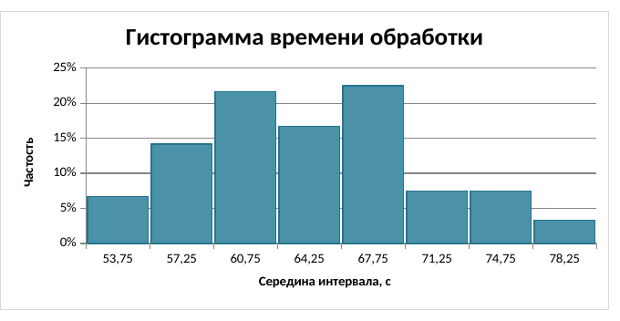
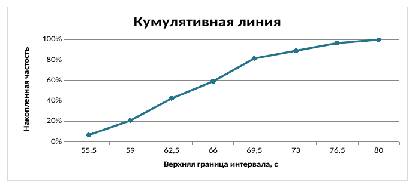

# Графическое представление эмпирического распределения

Таблица частот показывает распределение наблюдений точно, но не всегда позволяет быстро увидеть его форму. Для этого используют графики. В этом разделе построим в LibreOffice Calc гистограмму и кумулятивную линию для времени обработки заказов.

Гистограмма состоит из прямоугольников, соответствующих интервалам группировки. Их высоты показывают частости попадания наблюдений в интервалы. Кумулятивная линия показывает, какая доля наблюдений не превышает выбранную верхнюю границу. Поэтому первый график помогает оценить форму распределения, а второй — быстро находить накопленные доли.

## Подготовка интервального ряда

Число интервалов можно первоначально оценить по формуле Стерджеса:

$$
k = \left\lceil 1 + \log_2 n \right\rceil .
$$ {#eq-sturges-interval-count}

Здесь $n$ — число наблюдений, а скобки $\lceil\,\rceil$ означают округление вверх до целого. Ширину интервала определим по размаху выборки:

$$
h = \frac{x_{\max} - x_{\min}}{k}.
$$ {#eq-empirical-interval-width}

На практике значение $h$ удобно округлить вверх так, чтобы границы интервалов легко читались. Для каждого интервала вычисляют частоту $m_i$, частость $p_i^*$ и накопленную частость $F_i^*$:

$$
p_i^* = \frac{m_i}{n},
\qquad
F_i^* = \sum_{j=1}^{i} p_j^* .
$$ {#eq-empirical-relative-cumulative-frequency}

Сумма всех частот должна быть равна $n$, сумма частостей — единице, а последняя накопленная частость — $100\%$. Эти равенства удобно использовать как контроль расчёта.

## Пример: время обработки заказов

В журнале интернет-магазина зафиксировано время обработки 120 заказов. Значения находятся в диапазоне от $52$ до $79{,}8$ секунды. По @eq-sturges-interval-count получаем восемь интервалов, а вычисленную по @eq-empirical-interval-width ширину $3{,}475$ секунды округляем вверх до $3{,}5$ секунды:

$$
k = \left\lceil 1 + \log_2 120 \right\rceil = 8,
\qquad
h = \frac{79{,}8 - 52}{8} = 3{,}475 \approx 3{,}5.
$$

Полученный интервальный ряд имеет следующий вид.

| Интервал, с | Середина, с | Частота | Частость | Накопленная частость |
|---:|---:|---:|---:|---:|
| $[52; 55{,}5)$ | $53{,}75$ | 8 | $6{,}7\%$ | $6{,}7\%$ |
| $[55{,}5; 59)$ | $57{,}25$ | 17 | $14{,}2\%$ | $20{,}8\%$ |
| $[59; 62{,}5)$ | $60{,}75$ | 26 | $21{,}7\%$ | $42{,}5\%$ |
| $[62{,}5; 66)$ | $64{,}25$ | 20 | $16{,}7\%$ | $59{,}2\%$ |
| $[66; 69{,}5)$ | $67{,}75$ | 27 | $22{,}5\%$ | $81{,}7\%$ |
| $[69{,}5; 73)$ | $71{,}25$ | 9 | $7{,}5\%$ | $89{,}2\%$ |
| $[73; 76{,}5)$ | $74{,}75$ | 9 | $7{,}5\%$ | $96{,}7\%$ |
| $[76{,}5; 80]$ | $78{,}25$ | 4 | $3{,}3\%$ | $100\%$ |

Последний интервал замкнут справа, чтобы включить максимальное наблюдение. В остальных строках правая граница не входит в интервал: это исключает двойной учёт значений, совпавших с общей границей.

## Построение в LibreOffice Calc

Готовая рабочая книга содержит исходные наблюдения, формулы интервальной группировки и две диаграммы. Жёлтые ячейки на листе «Данные» можно заменить своими значениями. Лист «Распределение» пересчитает таблицу; если объём или размах данных существенно изменится, следует проверить число и ширину интервалов.

```{=latex}
\repolinkblock{book/images/17_empirical-distribution-calc-qr.png}{https://github.com/vshp-online/ps-it-book/blob/main/code/data/empirical-distribution-calc.ods}{code/data/empirical-distribution-calc.ods}
```

```{=html}
<div class="repo-material" role="group" aria-label="Материалы к примеру об эмпирическом распределении в LibreOffice Calc">
  <div class="repo-material-qr"></div>
  <div class="repo-material-path"><a href="https://github.com/vshp-online/ps-it-book/blob/main/code/data/empirical-distribution-calc.ods"><code>code/data/empirical-distribution-calc.ods</code></a></div>
</div>
```

Для гистограммы используются середины интервалов и частости. В Calc это столбчатая диаграмма с минимальным зазором между столбцами. Ось ординат показывает не абсолютное число заказов, а их долю в каждом интервале.

{#fig-empirical-histogram-calc fig-pos="H" fig-alt="Столбчатая диаграмма частостей для восьми интервалов времени обработки заказов"}

Наибольшие частости приходятся на интервалы от $59$ до $62{,}5$ секунды и от $66$ до $69{,}5$ секунды. При этом гистограмма не подтверждает сама по себе наличие нескольких устойчивых групп: для такого вывода нужны дополнительные данные и отдельный анализ.

Для кумулятивной линии по горизонтальной оси откладываются верхние границы интервалов, а по вертикальной — накопленные частости. Например, значение $81{,}7\%$ у границы $69{,}5$ секунды означает, что примерно четыре заказа из пяти были обработаны не дольше этого времени.

{#fig-empirical-cumulative-calc fig-pos="H" fig-alt="Линейная диаграмма накопленных частостей для восьми верхних границ интервалов"}

По кумулятивной линии удобно проверять выполнение требований к скорости. В рассматриваемых данных $89{,}2\%$ заказов обработаны не дольше $73$ секунд, а границу $76{,}5$ секунды не превышают $96{,}7\%$ заказов. Если целевое значение установлено на уровне $95\%$, второй из этих порогов достаточен, а первый — нет.

Гистограмма отвечает на вопрос, в каких интервалах сосредоточены наблюдения, тогда как кумулятивная линия связывает верхнюю границу времени с достигнутой долей заказов. Поэтому эти графики дополняют друг друга и строятся по одной таблице частот.

```{=latex}
\clearpage
```

## Тот же расчёт в Python

Исходные данные сохранены отдельно в `code/data/order-processing-times.csv`. Следующий короткий фрагмент воспроизводит ту же группировку и строит оба графика:

```{.python}
from math import ceil, log2

import matplotlib.pyplot as plt
import numpy as np

data = np.loadtxt(
    "code/data/order-processing-times.csv",
    delimiter=",",
    skiprows=1,
)
k = ceil(1 + log2(data.size))
h = ceil((np.ptp(data) / k) * 2) / 2
edges = data.min() + h * np.arange(k + 1)
counts, _ = np.histogram(data, bins=edges)
relative = counts / data.size

fig, axes = plt.subplots(1, 2, figsize=(10, 4))
axes[0].bar(
    edges[:-1],
    relative,
    width=h,
    align="edge",
    edgecolor="white",
)
axes[0].set(xlabel="Time, s", ylabel="Relative frequency")
axes[1].plot(edges[1:], np.cumsum(relative), marker="o")
axes[1].set(
    xlabel="Upper bound, s",
    ylabel="Cumulative frequency",
)
plt.tight_layout()
```

Здесь границы строятся тем же способом, что и в рабочей книге Calc. Поэтому частоты и накопленные частости совпадают, а различия могут касаться только оформления диаграмм.
