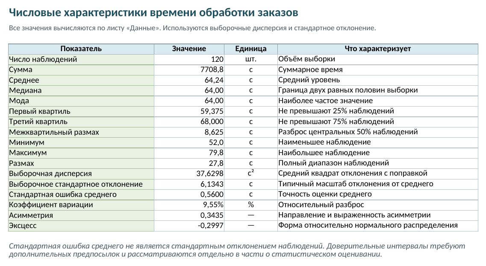

# Вычисление числовых характеристик в LibreOffice Calc и Python

В предыдущем разделе исходные наблюдения были сгруппированы по интервалам и представлены графически. Теперь вычислим их числовые характеристики непосредственно по исходной выборке. Повторно вводить данные не требуется: рабочая книга использует тот же лист «Данные».

Описательная статистика сводит выборку к нескольким показателям положения, рассеивания и формы. Эти показатели дополняют, но не заменяют графики: одинаковые средние и стандартные отклонения могут соответствовать распределениям разной формы.

## Какие показатели нужны

Для времени обработки заказов вычислим:

- число наблюдений, сумму, среднее, медиану и моду;
- первый и третий квартили, межквартильный и полный размах;
- выборочные дисперсию и стандартное отклонение;
- стандартную ошибку среднего и коэффициент вариации;
- коэффициент асимметрии и эксцесс.

В расчётах используются выборочные дисперсия и стандартное отклонение с делителем $n-1$. Стандартная ошибка среднего определяется формулой

$$
m_{\bar{x}}=\frac{s}{\sqrt{n}},
$$ {#eq-standard-error-mean}

где $s$ — выборочное стандартное отклонение. Стандартная ошибка характеризует точность оценки среднего, тогда как $s$ описывает разброс отдельных наблюдений. Смешивать эти величины нельзя.

Функции доверительных интервалов Calc здесь намеренно не используются. Доверительный интервал зависит от статистической модели и выполненных предпосылок; одной команды программы для обоснования этих предпосылок недостаточно. Интервальное оценивание среднего и дисперсии будет рассмотрено в части о методах математической статистики.

## Расчёт в LibreOffice Calc

Рабочая книга дополнена листом «Характеристики». Все результаты на нём связаны формулами с исходными наблюдениями. Если заменить значения на листе «Данные», таблица пересчитается вместе с интервальным рядом и диаграммами. В зависимости от языковых настроек Calc имена функций могут отображаться по-русски или по-английски; математический смысл формул при этом не меняется [@LibreOfficeCalcGuide].

```{=latex}
\repolinkblock{book/images/17_empirical-distribution-calc-qr.png}{https://github.com/vshp-online/ps-it-book/blob/main/code/data/empirical-distribution-calc.ods}{code/data/empirical-distribution-calc.ods}
```

```{=html}
<div class="repo-material" role="group" aria-label="Рабочая книга с описательной статистикой в LibreOffice Calc">
  <div class="repo-material-qr"></div>
  <div class="repo-material-path"><a href="https://github.com/vshp-online/ps-it-book/blob/main/code/data/empirical-distribution-calc.ods"><code>code/data/empirical-distribution-calc.ods</code></a></div>
</div>
```

Для основных показателей используются функции `AVERAGE`, `MEDIAN`, `MODE`, `QUARTILE.INC`, `VAR.S`, `STDEV.S`, `SKEW` и `KURT`. В русскоязычном интерфейсе среди их названий встречаются `СРЗНАЧ`, `МЕДИАНА`, `МОДА`, `КВАРТИЛЬ`, `ДИСП.В`, `СТАНДОТКЛОН.В`, `СКОС` и `ЭКСЦЕСС`.

Calc также умеет формировать стандартную таблицу через команду **Данные → Статистика → Описательная статистика**. В учебной рабочей книге показатели оставлены отдельными формулами: так видны выбранные определения, проще проверить ссылку на исходный диапазон и невозможно случайно принять стандартную ошибку за стандартное отклонение.

В первых строках таблицы находятся контрольные значения — число наблюдений и сумма. После замены исходных данных они помогают заметить неполный диапазон или пропущенные ячейки до интерпретации остальных результатов.

{#fig-descriptive-statistics-calc fig-pos="H" fig-alt="Таблица Calc со средним, медианой, квартилями, выборочной дисперсией, стандартным отклонением, стандартной ошибкой, коэффициентом вариации, асимметрией и эксцессом"}

## Интерпретация результатов

Среднее время обработки равно $64{,}24$ секунды, а медиана и мода — $64$ секунды. Близость этих трёх показателей говорит о том, что центр выборки не смещён заметно из-за отдельных крайних наблюдений.

Первый квартиль равен $59{,}375$ секунды, третий — $68$ секунд. Следовательно, центральные $50\%$ наблюдений занимают интервал шириной $8{,}625$ секунды. Полный диапазон значительно шире: от $52$ до $79{,}8$ секунды.

Выборочное стандартное отклонение составляет приблизительно $6{,}1343$ секунды, а коэффициент вариации — $9{,}55\%$. Эти показатели описывают разброс времени обработки, но не устанавливают сами по себе универсальную границу «малой» или «большой» вариации: такая граница зависит от требований конкретного процесса.

Стандартная ошибка среднего равна приблизительно $0{,}56$ секунды. Она значительно меньше стандартного отклонения, поскольку среднее по 120 наблюдениям устойчивее отдельного измерения. Коэффициент асимметрии $0{,}3435$ указывает на умеренно выраженный правый хвост, а эксцесс $-0{,}2997$ — на несколько более плоскую форму по сравнению с нормальным распределением. Эти коэффициенты следует рассматривать вместе с гистограммой, а не как самостоятельное доказательство вида распределения.

## Тот же расчёт в Python

В Python достаточно загрузить тот же CSV-файл и явно указать, что дисперсия и стандартное отклонение являются выборочными:

```{.python}
from statistics import multimode

import numpy as np

data = np.loadtxt(
    "code/data/order-processing-times.csv",
    delimiter=",",
    skiprows=1,
)
n = data.size
mean = data.mean()
standard_deviation = data.std(ddof=1)
q1, median, q3 = np.quantile(data, [0.25, 0.5, 0.75])

z = (data - mean) / standard_deviation
skewness = n / ((n - 1) * (n - 2)) * np.sum(z**3)
excess = (
    n * (n + 1)
    / ((n - 1) * (n - 2) * (n - 3))
    * np.sum(z**4)
    - 3 * (n - 1) ** 2 / ((n - 2) * (n - 3))
)

summary = {
    "mean": mean,
    "median": median,
    "mode": multimode(data)[0],
    "q1": q1,
    "q3": q3,
    "variance": data.var(ddof=1),
    "standard_deviation": standard_deviation,
    "standard_error": standard_deviation / np.sqrt(n),
    "coefficient_of_variation": standard_deviation / mean,
    "skewness": skewness,
    "excess": excess,
}
```

Параметр `ddof=1` задаёт делитель $n-1$. Без него NumPy вычислил бы дисперсию данного массива с делителем $n$, и результат не совпал бы с выборочной дисперсией на листе Calc.
